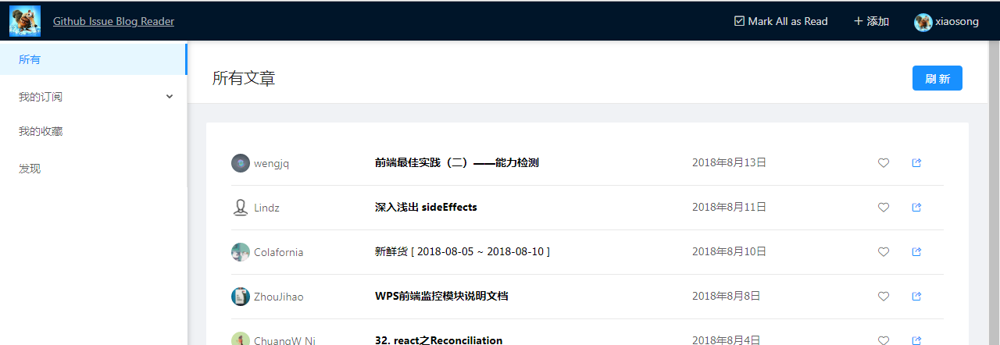
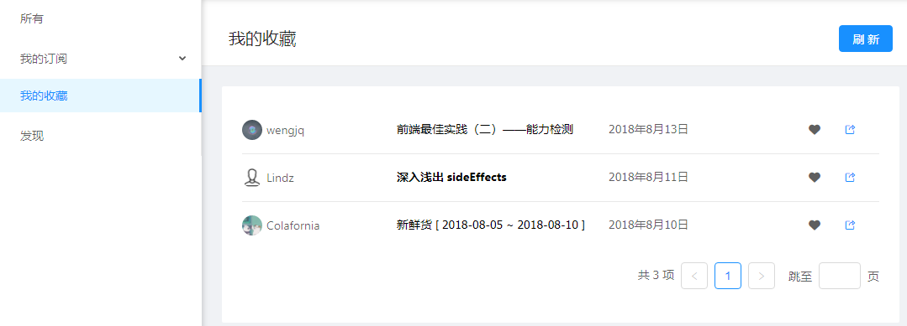
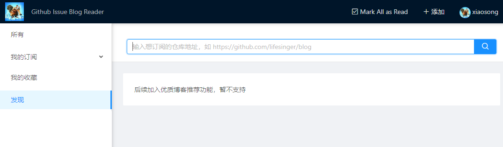
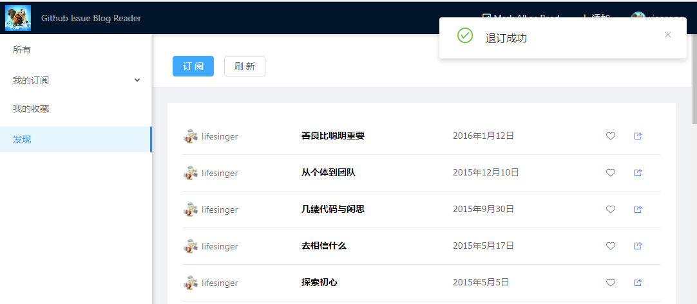
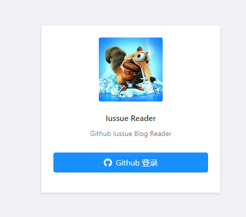

# Github 博客阅读工具

项目地址：https://issuereader.github.io

源码地址：https://github.com/IssueReader/issue-reader-dva

## 项目背景
目前很多高质量的博客使用 Github 仓库的 issue 作为管理工具，对于作者而言减少很多运维的成本，对于读者来说，却没有比较好的阅读工具。一般的做法是通过 watch，但是 watch 的仓库很多时，和其他代码仓库的 issue 混杂一起，会收到很多冗余信息(例如，issue 新增评论，或者新人用户新建无意义的 issue)，还经常有一些没有经验的菜鸟跑到博主的仓库中乱开 issue 导致一些骂战。Issue Reader 应运而生。

## 主要功能介绍
主要功能如下：
* 文章阅读：根据时间排序列出订阅的博客文章
* 收藏：好文收藏，随时温习
* 发现：搜索 Github 仓库进行订阅，同时提供了几个热门的博客推荐

## 技术栈

### 后端
* leancloud: 通过 leancloud 上的 nodejs 服务获取 github accessToken，解决前端无法直接通过 code 获取 token 问题

### 客户端
* 前端框架：react
* 样式库：ant design
* 数据路由管理框架：dva
* 数据存储：localForage，本地化数据存储，保存用户订阅与阅读记录
* 数据来源：通过 apollo-client 查询 GitHub API V4 (Graphql) 接口获取博客数据

### 构建工具
* create-react-app: 项目脚手架
* react-app-rewired: 配置 create-react-app

## 功能截图
1. 所有文章

(./images/1534256701448-6d0188c0-cc02-433b-ac5d-c766bb62be3c.png)

3. 收藏/取消收藏文章

4. 输入仓库地址添加订阅

5. Github 关注列表页面，快速订阅关注列表中的仓库

6. 使用 GitHub 授权登录

