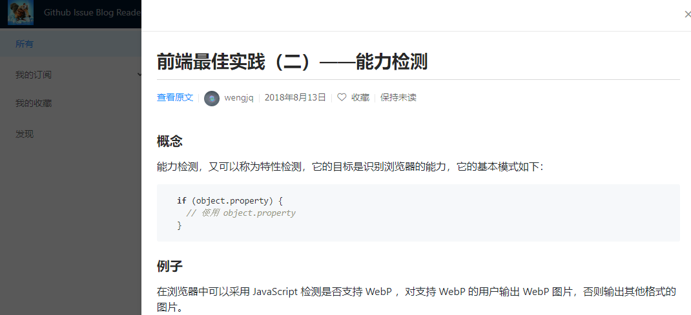

# IssueReader

项目地址：https://issuereader.github.io

源码地址：https://github.com/IssueReader/issue-reader-dva

## 项目背景
Github 上关注了一堆博客，没有比较合适的订阅工具，由此萌生了自己写一个作为练手的念头。

## 功能介绍
1. 所有文章

2. 文章详情

3. 收藏/取消收藏文章

4. 输入仓库地址添加订阅

5. Github 关注列表页面，快速订阅关注列表中的仓库

6. 使用 GitHub 授权登录

